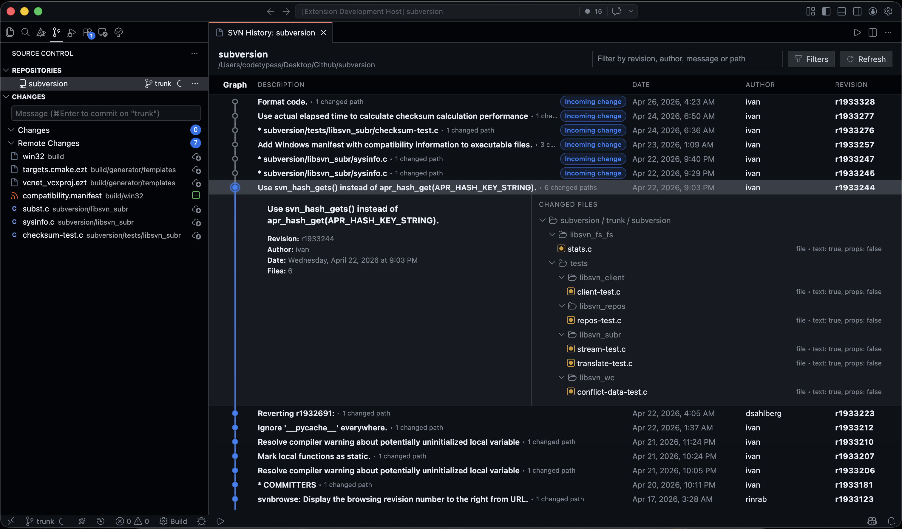

# SVN Tree

SVN Tree adds a focused Subversion workflow to Visual Studio Code. It integrates SVN working copies into the Source Control view, keeps diffs inside the editor, and exposes repository-aware actions for day-to-day maintenance, history inspection, and conflict handling.

## Highlights

- Global checkout command for creating new local working copies from SVN repository URLs.
- Native SCM integration for SVN working copies in the current workspace.
- Local, unversioned, conflict, and optional incoming remote change groups with inline actions.
- Built-in diff flows for working copy changes, incoming changes, file history, revision-to-revision comparison, and revision-to-working-copy comparison.
- Dedicated history webview with search, filters, infinite scroll, changed-file trees, copy/export actions, and revision-level operations.
- Dedicated repository browser webview with a file tree, current-directory and selected-entry details, and inline remote directory maintenance actions.
- Repository tools for switching references, revision-graph inspection, branch and tag management, cleanup, blame, properties, locks, and changelists.
- Dedicated `svn:ignore` editor for reviewing and saving ignore rules as one entry per line.
- Runtime UI localization in English or Simplified Chinese.

## Requirements

- Visual Studio Code 1.95 or newer.
- The `svn` command-line client must be installed and available on your `PATH`.
- To use working-copy features, open a workspace folder that is inside an SVN working copy.

If `svn` is unavailable, the extension stays inactive and shows a warning until the CLI is available.

## Getting Started

1. If you need a local working copy first, run `SVN Tree: Checkout SVN Repository URL` from the command palette.
2. Open a folder that belongs to an SVN working copy.
3. Open the Source Control view.
4. Review the `Changes`, `Unversioned`, `Conflict Artifacts`, and optional `Remote Changes` groups.
5. Enter a commit message in the SCM input box and run `SVN Tree: Commit SVN Changes`, or use the repository title actions to refresh, update, or open history.
6. Use file and repository context menus for path-specific operations such as diff, blame, properties, ignore, lock, history, revision graph, or repository browsing.

## What You Can Do

- Acquire working copies: check out any absolute SVN repository URL to a new local folder at `HEAD` or a specific revision.
- Track working copy changes: refresh status, review diffs, update the working copy, commit the whole repository, commit selected paths, update selected paths, and run cleanup after interrupted operations.
- Inspect history: open repository or file history, filter revisions by author, commit message, changed path, and date range, then compare revisions, copy commit messages, export files, or update and check out to a selected revision.
- Browse repository structure: open a dedicated repository browser panel, move through repository directories in a tree view, inspect selected directories or files, open repository files, and run current-directory or selected-entry actions from the side panel.
- Manage repository references: switch branch or tag, inspect repository layout in the revision graph, update to a specific revision, relocate a working copy, create or delete branches and tags from the working copy, and create, copy, move, or delete remote directories from the repository browser.
- Work with paths and metadata: add, delete, revert, rename, ignore or unignore, edit dedicated `svn:ignore` rules, lock or unlock, reveal in the file manager, inspect SVN info, edit properties, and open blame or annotate views.
- Handle conflicts and changelists: mark conflicts as resolved, accept local, base, or incoming variants, postpone resolution, and add or remove files from SVN changelists.

## Commands

Most commands are context-sensitive and are available from the Source Control view, file explorer context menus, or repository action menus.

- Global and repository commands: `Checkout SVN Repository URL`, `Refresh SVN Status`, `Update SVN Working Copy`, `Commit SVN Changes`, `Open SVN History`, `Open SVN Revision Graph`, `More SVN Actions`, `Show SVN Output`, `Cleanup SVN Working Copy`, `Update Working Copy To Revision`, `Switch Branch Or Tag`, `Merge Revision Into Working Copy`, and `Relocate Working Copy`.
- Path and change commands: `Open Diff`, `Open File`, `Open File History`, `Commit Selected Changes`, `Update Selected Paths`, `Update Selected Paths To Revision`, `Add Resource`, `Revert Resource`, `Delete Resource`, `Rename`, `Ignore Path`, `Unignore Path`, `Edit SVN Ignore Rules`, `Lock`, `Unlock`, `Add To Changelist`, `Remove From Changelist`, and `Reveal In File Manager`.
- Metadata and repository tools: `Blame / Annotate`, `Show Properties`, `Edit Properties`, `Show SVN Info`, `Copy Repository URL`, `Copy Repository Path`, and `Repository Browser` with tree navigation, selected-entry actions, and current-directory remote maintenance actions.
- Branch, tag, and conflict commands: `Create Branch From Working Copy`, `Create Tag From Working Copy`, `Delete Branch / Tag`, `Mark Conflict As Resolved`, `Accept Local Version`, `Accept Base Version`, `Accept Incoming Version`, and `Postpone Conflict Resolution`.

## Settings

- `svn-tree.displayLanguage`: preferred runtime UI language for prompts, quick picks, and webviews. Supports `auto` (default), `en`, and `zh-CN`.
- `svn-tree.enable-remote-status`: fetch incoming changes with `svn status -u`.
- `svn-tree.remote-status-interval-seconds`: interval between automatic remote status refreshes. Default: `60`. Minimum: `10`.
- `svn-tree.max-log-entries`: number of revisions loaded per batch in the history webview. Default: `200`. Minimum: `20`.
- `svn-tree.revision-graph-trunk-names`: directory names treated as trunk roots in the revision graph. Default: `["trunk"]`.
- `svn-tree.revision-graph-branch-container-names`: directory names treated as branch containers in the revision graph. Default: `["branches"]`.
- `svn-tree.revision-graph-tag-container-names`: directory names treated as tag containers in the revision graph. Default: `["tags"]`.

## Development

- SDD baseline and spec template: [docs/sdd/README.md](docs/sdd/README.md)

## Notes

- SVN Tree uses your installed `svn` CLI and its existing authentication configuration.
- Large repositories can make `svn status -u` and verbose history queries slower. Disable remote status if you prefer a lighter refresh cycle.
- Repository browser, history, and revision-graph panels are retained webviews, so they keep navigation state while you work elsewhere in VS Code.
- Command output is written to the `SVN Tree` output channel for troubleshooting.

## Support

Need help or want to report a bug?

- Issues: https://github.com/codetypess/vscode-svn-tree/issues
- Repository: https://github.com/codetypess/vscode-svn-tree

## License

MIT
